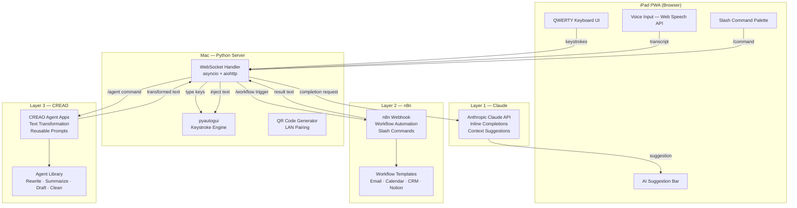

Here's the full updated README:

---

# AirKeys AI

> **Turn your iPad into an intelligent wireless keyboard for your Mac — with three layers of AI built in.**

<p align="center">
  
</p>

<p align="center">
  <a href="#quick-start"><strong>Quick Start</strong></a> ·
  <a href="#three-layer-ai-architecture"><strong>Architecture</strong></a> ·
  <a href="#slash-commands"><strong>Slash Commands</strong></a> ·
  <a href="#contributing"><strong>Contributing</strong></a>
</p>

<p align="center">
  
  
  
  
  
  
</p>

---

## What is AirKeys AI?

AirKeys AI is an **iPad PWA** that turns your iPad into a full QWERTY wireless keyboard for your Mac — with no Bluetooth pairing, no app store, no cables. Just scan a QR code and start typing.

But unlike a traditional wireless keyboard, AirKeys AI has a **brain**. Every keystroke passes through a three-layer AI stack:

1. **Claude** — inline completions and context-aware suggestions as you type
2. **n8n** — slash commands that trigger real automation workflows on your local or cloud n8n instance
3. **CREAO** — reusable agent apps that transform text in one tap (rewrite, summarize, clean up dictation, draft replies)

The entire system runs from a **single Python file** on your Mac. No cloud required. One port. Scan and go.

---

## Three-Layer AI Architecture



### Layer 1: Claude (Inline AI)

Claude watches your typing context and surfaces smart completions in a suggestion bar above the keyboard. Accept a suggestion with a single tap — it types itself into whatever app is focused on your Mac.

- **Inline completions** — finishes your sentence based on what you're writing
- **Smart suggestions** — offers alternatives, corrections, and continuations
- **Context-aware** — understands coding, prose, email, and markdown contexts
- **Streaming** — suggestions appear as Claude generates them, no waiting

### Layer 2: n8n (Workflow Automation)

Type a slash command and trigger a real n8n workflow. The result comes back as typed text directly into your active Mac application.

- `/email-draft` — drafts a professional email from your notes
- `/calendar-event` — creates a calendar event from natural language
- `/notion-log` — logs a note to your Notion workspace
- `/crm-update` — updates a CRM record with what you just dictated
- Connect **any webhook-capable service** — the command is just a trigger

### Layer 3: CREAO (Agent Apps)

CREAO provides a library of pre-built agent apps for text transformation. Each app is a reusable, one-tap operation.

- `/rewrite-professional` — rewrites casual text in professional tone
- `/summarize-notes` — condenses long notes into bullet points
- `/meeting-followup` — turns meeting notes into a structured follow-up
- `/clean-dictation` — fixes punctuation and grammar in voice transcripts
- `/draft-reply` — drafts a reply based on selected context

---

## Features

| Feature | Description |
|---|---|
| **QWERTY Keyboard** | Full keyboard layout optimized for iPad, including special characters and modifier keys |
| **Voice Input** | Web Speech API dictation — speaks directly into any Mac app |
| **AI Suggestion Bar** | Claude-powered completions above the keyboard, accept with one tap |
| **Slash Commands** | Trigger n8n workflows and CREAO agent apps from the keyboard |
| **QR Code Pairing** | Scan QR code to connect iPad to Mac — no setup, no Bluetooth |
| **Single Port** | One WebSocket server handles everything — keyboard, voice, AI, and workflows |
| **PWA** | Installable on iPad home screen, works offline for basic typing |
| **Zero Latency Typing** | pyautogui injects keystrokes at the OS level — works in every Mac app |

---

## Tech Stack

| Layer | Technology |
|---|---|
| **Server** | Python 3.11+, asyncio, aiohttp |
| **Transport** | WebSocket (native browser API) |
| **Keystroke Engine** | pyautogui |
| **AI Completions** | Anthropic Claude API (claude-3-5-sonnet) |
| **Workflow Automation** | n8n (self-hosted or cloud) |
| **Agent Apps** | CREAO API |
| **Voice Input** | Web Speech API (browser-native) |
| **QR Pairing** | qrcode[pil] + Pillow |
| **Frontend** | Vanilla JS, HTML5, CSS — no framework |

---

## Quick Start

### Prerequisites

- Mac with Python 3.11+
- iPad with Safari (or any modern browser)
- Both devices on the same Wi-Fi network

### 1. Clone and install

```bash
git clone https://github.com/nuriygold/airkeysAI.git
cd airkeysAI
pip install -r requirements.txt
```

### 2. Set your environment variables

```bash
cp .env.example .env
# Edit .env and add your API keys
```

```env
ANTHROPIC_API_KEY=sk-ant-...
N8N_WEBHOOK_URL=https://your-n8n-instance.com   # optional
CREAO_API_KEY=...                                 # optional
```

### 3. Start the server

```bash
python server.py
```

You'll see output like:

```
AirKeys AI server running at ws://192.168.1.42:8765
Scan this QR code on your iPad:

█████████████████
█ ▄▄▄▄▄ █▄█ ▄▄▄▄▄ █
█ █   █ █▀▄ █   █ █
...

Open http://192.168.1.42:8765 on your iPad
```

### 4. Connect your iPad

Scan the QR code with your iPad camera, or open the URL in Safari. Tap **"Add to Home Screen"** to install as a PWA.

Start typing — every keystroke appears instantly in whatever app is focused on your Mac.

---

## Slash Commands

Type `/` to open the command palette. Commands are sent to n8n or CREAO and the result is typed into your active Mac app.

### n8n Workflow Commands

| Command | Description | n8n Workflow |
|---|---|---|
| `/email-draft` | Draft a professional email from notes | `airkeys-email-draft` |
| `/calendar-event` | Create calendar event from natural language | `airkeys-calendar` |
| `/notion-log` | Log note to Notion | `airkeys-notion` |
| `/crm-update` | Update CRM with dictated context | `airkeys-crm` |
| `/slack-message` | Draft and send a Slack message | `airkeys-slack` |
| `/github-issue` | Create a GitHub issue from notes | `airkeys-github` |

### CREAO Agent Commands

| Command | Description | Agent App |
|---|---|---|
| `/rewrite-professional` | Rewrite text in professional tone | `creao-rewrite` |
| `/summarize-notes` | Condense notes to bullet points | `creao-summarize` |
| `/meeting-followup` | Structure meeting notes as follow-up email | `creao-meeting` |
| `/clean-dictation` | Fix punctuation and grammar in voice transcript | `creao-clean` |
| `/draft-reply` | Draft a reply based on selected context | `creao-reply` |
| `/translate` | Translate selected text | `creao-translate` |

### Claude Commands

| Command | Description |
|---|---|
| `/expand` | Expand a brief note into full prose |
| `/shorten` | Condense selected text |
| `/fix-grammar` | Grammar and style correction |
| `/rephrase` | Rewrite with different phrasing |

---

## Workflow Templates

The `workflows/` directory contains ready-to-import n8n workflow templates and CREAO agent app configs:

```
workflows/
├── n8n/
│   ├── airkeys-email-draft.json
│   ├── airkeys-calendar.json
│   ├── airkeys-notion.json
│   └── airkeys-slack.json
└── creao/
    ├── rewrite-professional.json
    ├── summarize-notes.json
    ├── meeting-followup.json
    └── clean-dictation.json
```

Import the n8n templates via **Settings → Import** in your n8n instance. CREAO templates are importable via the CREAO dashboard.

---

## Project Structure

```
airkeysAI/
├── server.py              # Python asyncio WebSocket server (main entry point)
├── static/                # Frontend PWA (HTML, CSS, JS) — served by aiohttp
├── workflows/             # n8n and CREAO workflow/agent templates
│   ├── n8n/
│   └── creao/
├── docs/                  # Architecture docs and API reference
├── assets/                # Logo, screenshots, favicon, banner
├── requirements.txt       # Python dependencies
├── .env.example           # Environment variable template
├── vercel.json            # Vercel config (static frontend hosting)
└── LICENSE                # MIT
```

---

## Architecture Notes

- **Single-port design** — aiohttp serves both static files (HTTP) and WebSocket on the same port. No nginx, no reverse proxy needed.
- **LAN-only by default** — the server binds to your local IP. No traffic leaves your network unless you explicitly configure n8n or CREAO cloud endpoints.
- **No pairing protocol** — the QR code is just a URL. Multiple iPads can connect simultaneously.
- **AI is optional** — if no `ANTHROPIC_API_KEY` is set, the keyboard still works perfectly; suggestions are silently disabled.
- **pyautogui accessibility** — on macOS, you must grant Accessibility permission to Terminal (or your Python runtime) in **System Settings → Privacy → Accessibility**.

---

## Remote Access & Deployment

By default, AirKeys is only accessible on your local Wi-Fi network. For hackathons, demos, or remote access from different networks, create a **public HTTPS tunnel** using `localhost.run` (no account or setup required).

### One-Command Public Tunnel

In a new Terminal, run:

```bash
ssh -R 80:localhost:8766 nokey@localhost.run
```

You'll get output like:

```
forwarding https://xxxx-xxxx-xxxx.localhost.run → http://localhost:8766
```

Copy that public URL and share it. Anyone on any network can now access your AirKeys keyboard.

**Why localhost.run:**
- ✅ No account required
- ✅ No API key or authentication
- ✅ Automatic HTTPS
- ✅ Free forever
- ✅ One SSH command — no setup

### Hackathon Submission

For hackathon submissions (Devpost, etc.), submit the public localhost.run URL as your **demo link**. Users can connect their iPad to your keyboard from anywhere.

---

## Hackathon

AirKeys AI was built for **LovHack Season 2** — a hackathon celebrating creative technology, human-AI collaboration, and tools that make everyday workflows more expressive.

The three-layer architecture (Claude + n8n + CREAO) was designed to show how AI isn't one monolithic thing — it's a composable stack where each layer adds a distinct kind of intelligence.

---

## Sponsors & Acknowledgments

| | |
|---|---|
| **Anthropic / Claude** | Claude API powers the inline AI completions and text transformation layer |
| **n8n** | Open-source workflow automation platform enabling the slash command integration |
| **CREAO** | Agent app platform providing reusable, one-tap text transformation workflows |

---

## Contributing

Pull requests are welcome. For major changes, please open an issue first.

1. Fork the repo
2. Create a feature branch (`git checkout -b feature/your-feature`)
3. Commit your changes (`git commit -m 'Add your feature'`)
4. Push to the branch (`git push origin feature/your-feature`)
5. Open a Pull Request

---

## License

MIT © [Nuriy Gold](https://github.com/nuriygold) / Nuriy Inc.

AirKeys AI is released under the [MIT License](LICENSE), an [OSI-approved open source license](https://opensource.org/licenses/MIT). You are free to use, modify, and distribute this software under its terms.

See [LICENSE](LICENSE) for full text.
